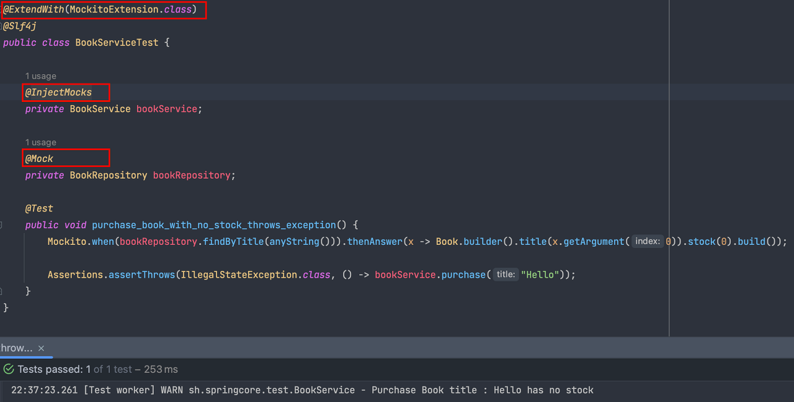
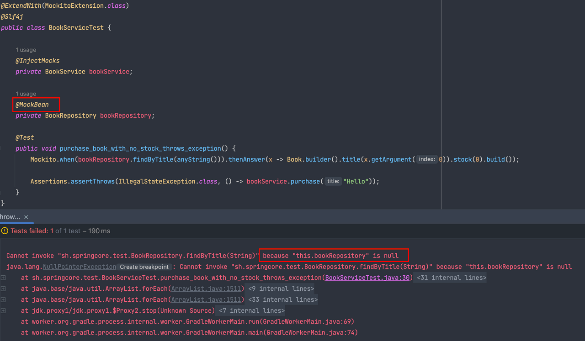

# 0. 들어가면서
테스트 코드를 작성하는 것은 크게 두 가지 이유로 중요하다고 생각합니다.
 - 다른 사람이 작성한 코드에 대한 신뢰
 - 내가 작성한 코드에 대한 신뢰

코드 베이스의 안정성, 테스트 코드를 짜기 위한 코드 자체의 내성, 효율적인 코드에 대한 고민 등도 테스트 코드의 중요성에 대한 이유가 될 수 있고 그 외에도 여러가지 이유가 있을 수 있습니다.

하지만 저는 위 두 가지 이유가 테스트 코드를 작성하는 가장 큰 이유라고 생각하고, 이번 글에서는 어떤 식으로 테스트 코드를 작성하면 좋을 지에 대해 정리해보겠습니다.

정리한 내용은 객관적인 사실을 쓴 것도 있고, 제 생각 자체 혹은 팀 코드 베이스 기반에서 더 나은 방식에 대한 주관적인 내용을 기반으로 합니다.


# 1. Junit4 to Junit5
[Junit](https://github.com/junit-team)은 Java 언어용 Unit Test 프레임워크입니다.

Junit4는 2021년 2월 14일이 마지막 Release, Junit5는 2023년 1월 10일이 마지막 Release로 현재 5.9.2가 최신 버전이며 Junit5는 Java8 / Spring 5.0.0, Springboot는 2.2 버전부터 사용 가능합니다. 
현재 팀 내 프로젝트 버전에서는 모두 사용할 수 있는 환경입니다.

한편, Junit5는 Junit4가 단일 jar 프로젝트였던 것에 반해 크게 `Junit Platform + Junit Jupiter + Junit Vintage` 세 가지 모듈로 작성되어 있고 필요에 따라 Import하는 모듈이 다르게 됩니다.


- junit-platform-engine
  - JVM 동작하는 테스트 프레임워크로 테스트를 발견하고 테스트 계획 생성 및 결과를 생성하는 Test Engine 인터페이스를 정의합니다. 
- junit-jupiter-api
  - Test Engine의 실제 구현체입니다. Junit5 기반 테스트를 실행시키기 위한 Engine을 Platform에 제공합니다. @Test, Lifecycle 어노테이션, Assertions 등의 기능이 여기에서 정의됩니다.
- junit-vintage-engine
  - Test Engine에서 이전 Junit3, 4 기반 테스트를 실행하기 위한 기능을 제공합니다.

그 외에 부가적인 기능을 제공하기 위한 각 모듈은 필요에 따라 Import해서 사용하면 됩니다.

## 1-1. Maven Dependency
Junit5의 가장 최신 Release + 중요 모듈을 기반으로 Maven Dependency를 작성하면 아래와 같습니다. Junit4는 사용하지 않아 vintage는 제외합니다.
```
<properties>
    ...
    <junit.jupiter.version>5.9.2</junit.jupiter.version>
    <junit.platform.version>1.9.1</junit.platform.version>
</properties>

<dependency>
    <groupId>org.junit.jupiter</groupId>
    <artifactId>junit-jupiter-engine</artifactId>
    <version>${junit.jupiter.version}</version>
    <scope>test</scope>
</dependency>
<dependency>
    <groupId>org.junit.jupiter</groupId>
    <artifactId>junit-jupiter-api</artifactId>
    <version>${junit.jupiter.version}</version>
    <scope>test</scope>
</dependency>
<dependency>
    <groupId>org.junit.jupiter</groupId>
    <artifactId>junit-jupiter-params</artifactId>
    <version>${junit.jupiter.version}</version>
    <scope>test</scope>
</dependency>
<dependency>
    <groupId>org.junit.platform</groupId>
    <artifactId>junit-platform-suite</artifactId>
    <version>${junit.platform.version}</version>
    <scope>test</scope>
</dependency>
</dependencies>
```


## 1-2. 변화
Junit5에서 제공하는 기능들에 대해 간단하게 짚어보겠습니다.

### Annotations
- @Test 
  - 테스트 메서드를 지정합니다.
- @BeforeAll
  - 테스트 클래스 내 모든 메서드가 실행되기 전에 1번 실행됩니다.
- @AfterAll
  - 테스트 클래스 내 모든 메서드가 실행된 후에 1번 실행됩니다.
- @BeforeEach
  - 각 테스트 메서드를 실행하기 전에 실행됩니다.
- @AfterEach 
  - 각 테스트 메서드를 실행한 후에 실행됩니다.
- @Disabled
  - 테스트를 실행하지 않습니다. 테스트를 실행하지 않는 이유도 명시할 수 있습니다.
- @ExtendWith
  - Junit4의 @Rule을 대체해서 확장 기능을 구현합니다. 
    - 예를 들어, @ExtendWith(SpringExtension.class)를 사용하면 Spring TestContext Framework를 Junit5에서 사용할 수 있습니다.
    - 이를 사용함으로써 테스트 클래스 내에서 @Autowired, @MockBean과 같은 어노테이션 사용이 가능해집니다. Junit5가 @Autowired를 지원하는 것은 아니니까요.
- @DisplayName
  - 테스트 메서드 혹은 클래스 단위에 커스텀화 된 이름을 지정할 수 있습니다.

#### @ExtendWith(SpringExtension.class) VS @SpringBootTest
@ExtendWith(SpringExtension.class)와 @SpringBootTest 모두 Application Context를 로드해서 테스트를 수행합니다. 

다만, @ExtendWith(SpringExtension.class)는 ApplicationContext를 로드할 뿐, 필요한 빈이나 컴포넌트를 생성하거나 등록하지는 않습니다.

이에 비해 @SpringBootTest는 애플리케이션 컨텍스트를 로드하면서, 애플리케이션에서 필요한 빈이나 컴포넌트를 모두 생성하고 등록합니다.

따라서 @SpringBootTest가 통합 테스트에서 주로 사용되고, @SpringBootTest 안에는 @ExtendWith(SpringExtension.class)가 포함됩니다.


그런데 일반적으로 Application Context에 존재하는 모든 Bean을 로딩해서 단위 테스트에서 쓰는 것이 조금 버겁기 때문에, @ExtendWith(SpringExtension.class)를 사용하면서 @ContextConfiguration을 통해 필요한 Bean을 주입하거나, @SpringBootTest에 필요한 클래스들을 명시해서 주입해서 사용한다고 이해하면 됩니다.

### Assertions
- assertEquals
  - 두 값을 비교하여 equals 판단합니다.
- assertNull, assertNotNull
  - 객체의 Null 여부를 판별합니다.
- assertSame, assertNotSame
  - 두 변수의 참조값의 동일함을 판단합니다.
- assertTrue, assertFalse
  - 특정 조건의 진실/거짓을 판단합니다.
- assertIterableEquals
  - 두 Iterable 요소를 동일한 순서로 반환해서 비교합니다.
  - 아래 코드가 동작합니다.
  ```
  @Test
  public void iterable_assert_test() {
    Iterable<String> al = new ArrayList<>(asList("Java", "Junit", "Test"));
    Iterable<String> ll = new LinkedList<>(asList("Java", "Junit", "Test"));
  
    assertIterableEquals(al, ll);
  }
  ```
- assertThrows
  - 특정 예외가 발생했는지 확인합니다.
  - 첫번째 인자로 예외 클래스를 선언하고, 두 번째 인자로 테스트하려는 코드를 작성하면 되는데, 람다식을 활용하면 좋습니다.


# 2. Mock을 이용한 테스트 코드 작성
Mock은 쉽게 말해 `가짜 객체를 생성해서 실제 애플리케이션에서 사용하는 객체의 상태나 리턴값 등을 제어하기 위해` 사용합니다.

Mock을 쓰느냐 마느냐, 어떤 상황에서 어느 정도로 쓰느냐에 대한 논의는 복잡합니다.

하지만, 우리 팀의 서비스 코드 내에서 테스트 코드를 작성하기 위해서는 `Mock의 적극적인 사용이 불가피`합니다. 많은 의존성, 메서드끼리의 잦은 호출, 외부 API 호출 등을 Stub으로 일일이 만드는 것이 불가능에 가깝기 때문입니다.

따라서 테스트 코드를 어떻게 짜야 좋은가, Mock을 언제 어떻게 쓰느냐에 대한 논의는 차치하고 실제 테스트 코드에서 Mock을 사용하는 전반적인 방식에 대해 설명만 하겠습니다. 


## 2-2. Mockito 프레임워크
Mockito는 JAVA 오픈 소스 테스트 프레임워크입니다. 이를 사용해서 Mock 객체를 쉽고 간편하게 생성하고 활용할 수 있습니다.

## 2-3. Springboot + Mockito 사용기

### @SpringBootTest + @MockBean
위에서 설명한 것처럼 @SpringBootTest는 Junit 테스트에서 @SpringBootApplication 어노테이션을 찾아 하위의 모든 Bean들을 스캔하여 Spring ApplicationContext를 로딩하는 데 사용됩니다.
그리고 이렇게 로딩된 컨텍스트 아래에서 @Autowired로 간단하게 테스트의 대상이 되는 객체를 주입할 수 있게 됩니다.
한편, @MockBean 역시 SpringBoot에서 제공하는 어노테이션으로, Spring ApplicationContext에서 관리되는 Bean을 대체하기 위해 Mockito와 함께 사용됩니다.

즉, @SpringBootTest를 통해 로드한 빈을 Mock 객체로 주입할 수 있게 만드는 것이죠.
코드를 보면서 설명하겠습니다.

####[BookService.java]
```
@Service
@RequiredArgsConstructor
@Slf4j
public class BookService {
    private final BookRepository bookRepository;
    private final DeliveryService deliveryService;

    public Book purchase(String title) {
        Book book = bookRepository.findByTitle(title);

        if (book == null) {
            log.warn("Purchase Book title : {} does not exist", title);
            throw new EntityNotFoundException("해당 도서는 존재하지 않습니다.");
        }

        if (book.getStock() <= 0) {
            log.warn("Purchase Book title : {} has no stock", title);
            throw new IllegalStateException("해당 도서의 재고가 부족합니다.");
        }

        // 비즈니스 로직
        // ...
        // 재고를 조정한다.
        updateStock(book);

        deliveryService.deliver();

        return book;
    }
    
    ...
}
```
bookRepository에서 책의 이름을 통해 책을 조회하고 책이 존재하지 않으면 EntityNotFoundException, 책의 재고가 부족하면 IllegalStateException을 일으킵니다.

이 상황에서 '책의 재고가 부족할 때 적절한 예외가 발생하는지'를 테스트하기 위해 아래와 같이 테스트 코드를 작성할 수 있습니다.


bookRepository를 @MockBean으로 등록하여 실제 BookService 내에서 동작하는 BookRepository의 동작을 제어하고 있습니다.

즉, 위 테스트 코드에서는 어떤 책의 제목으로 조회하더라도 재고가 0인 상태의 책을 리턴하여 IllegalStateException이 발생하는 것을 테스트할 수 있죠.

### @SpringBootTest는 단위 테스트에서 사용하기엔 너무 무겁다.
하지만 위와 같은 단위 테스트를 위해 @SpringBootTest를 사용하여 모든 Bean들을 불러오게 되면 테스트 클래스마다 로딩 시간이 쌓이게 되 테스트 자체는 몇 초로 끝나지만 테스트 환경을 구성하는 데 수 분이 넘게 소요되는 결과를 낳게 됩니다.

어플리케이션의 규모가 커지면 관리하는 Bean만 수 백개가 넘기 때문이죠.
그렇다면 @SpringBootTest 없이 Mock 기반 단위 테스트를 어떻게 작성할 수 있을까요?

먼저, 단순히 위 테스트 코드에서 @SpringBootTest 을 사용하지 않고 @ExtendWith(MockitoExtension.class)를 사용해보면 아래와 같이 this.bookRepository에 대한 NullPointerException이 터지게 됩니다.


이유는 @ExtendWith(MockitoExtension.class) 어노테이션이 사용되어 테스트 클래스에서 Mockito를 사용하도록 지정되었지만, 이 클래스에는 Spring ApplicationContext가 로드되지 않아 @Autowired로 BookService를 주입할 수 없는 것이죠.

### @SpringBootTest는 단위 테스트에서 사용하기엔 너무 무겁다.
따라서 위와 같은 문제를 해결하기 위해 @InjectMocks + @Mock 어노테이션을 사용할 수 있습니다.


@InjectMocks는 Mockito 프레임워크에서 사용되는 어노테이션으로, 목 객체를 생성하고 주입하는 데 사용됩니다.
위 테스트 코드에서는 @ExtendWith(MockitoExtension.class) 어노테이션을 클래스에 추가해서 Mockito를 활성화하고, @InjectMocks 어노테이션을 BookService에 추가하여 목 객체의 의존성을 주입하는 것이죠.

그리고 BookRepository에는 @Mock 어노테이션을 추가해서 BookService에 대한 의존성을 실제 BookRepository가 아닌, Mock BookRepository로 주입한 것입니다. 그래서 우리가 원하는대로 테스트 코드가 성공할 수 있게 됩니다.

### @Mock vs @MockBean
@Mock 어노테이션과 @MockBean 어노테이션은 서로 다른 목 객체를 생성합니다.

@Mock 어노테이션은 Mockito에서 제공하는 목 객체를 생성하는 데 반해 @MockBean 어노테이션은 스프링에서 제공하는 목 객체를 생성합니다.
따라서, @MockBean 어노테이션을 사용해서 목 객체를 생성하려면 스프링 Context가 필요하고 이를 위해 맨 처음에 말한 @SpringBootTest 등의 컨텍스트 로딩을 위한 어노테이션이 필요합니다.

그래서 위의 테스트 코드에서 @Mock 어노테이션을 @MockBean으로 대체하게 되면 아래와 같이 BookRepository에 대한 NullPointerException이 다시 발생하게 됩니다.
